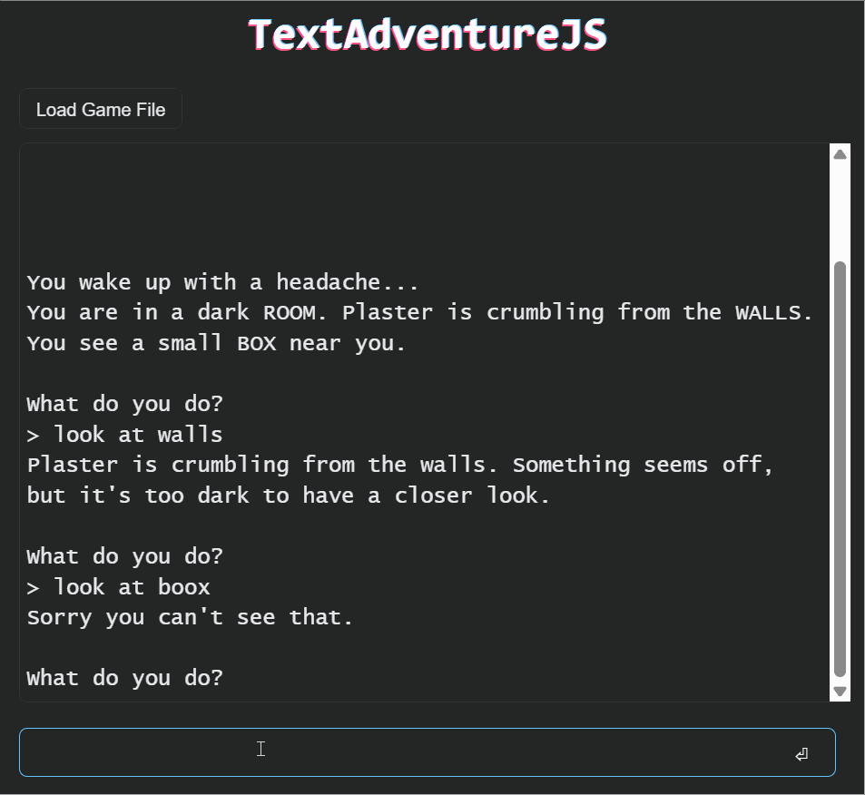
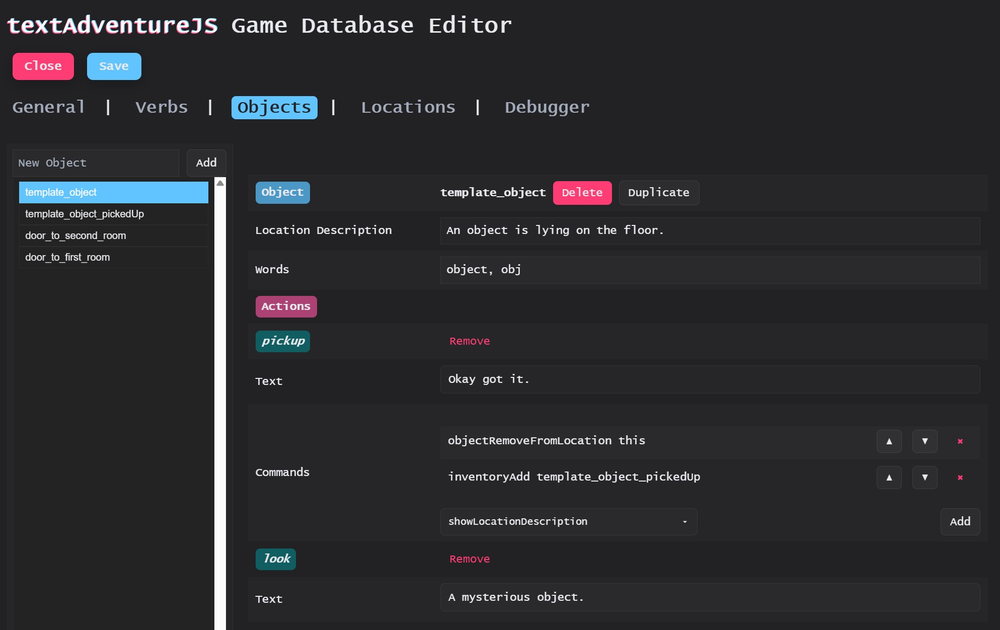

# TextAdventureJS

A text based adventure engine written in JavaScript.
Create your own text adventure games and embed them into your website, or share and play them with the included demo player.

- Games are json files, that follow the textAdventureGameDatabase-schema (tadb).
- Editor folder contains an editor that allows to create games with a GUI.
- Player folder contains a demo player that shows how to integrate the engine

The library and the player are written in pure JavaScript.
The editor uses jQuery.

## Player


Try it here: https://dak0r.github.io/TextAdventureJS/player/

## Editor

This repo also provides a full editor including debugger functionality for creating your own games:



Try it here: https://dak0r.github.io/TextAdventureJS/editor/

## Usage
Usage is simple: the engine needs to be initialized with a JS functions that allows the engine to write output and to clear all written output. Then any compatible game file can be loaded:
```js
  var textAdvEngine = new textAdventureEngine(writeLine, clearArea);
  textAdvEngine.loadDatabaseFromFile(
    "https://dak0r.github.io/TextAdventureJS/games/new_project.tadb.json"
  );
```
A minimalistic working example, which uses jquery to keep it short:

```html
<!DOCTYPE html>
<html>
  <head>
    <script src="https://code.jquery.com/jquery-3.5.1.min.js"></script>
    <script src="https://dak0r.github.io/TextAdventureJS/textAdventure.js"></script>
    <script>
      $(document).ready(function () {
        // Defines where to write output
        function writeLine(outputLine) {
          $("#gameLog").append(outputLine + "<br />");
        }
        // Clears written output from the area
        function clearArea() {
          $("#gameLog").html("");
        }
        // Read user input
        function readInput() {
          const inputText = $("#inputField").val().trim();
          writeLine(inputText);
          textAdvEngine.input(inputText);
          $("#inputField").val("");
        }

        // Add event handler for reading user input:
        $("#submitButton").click(function () {
          readInput();
        });

        // Init textAdventureJS and load a game
        var textAdvEngine = new textAdventureEngine(writeLine, clearArea);
        textAdvEngine.loadDatabaseFromFile(
          "https://dak0r.github.io/TextAdventureJS/games/new_project.tadb.json"
        );
      });
    </script>
  </head>
  <body>
    <div id="gameLog" style="width: 600px; height: 500px"></div>
    <input id="inputField" style="width: 500px" type="text" />
    <button id="submitButton">Submit</button>
  </body>
</html>
```

See [player/index.html](./player/index.html) for a more complex example.

## Game Database

A Text Adventure Game Database is JSON file which describes games that can run in the TextAdventureJS Engine.

These game files can be validated using the JSON schema in this repo: [textAdventureGameDatabase.schema.json](./textAdventureGameDatabase.schema.json).

 I recommend using the [JSON Schema Validator](https://marketplace.visualstudio.com/items?itemName=tberman.json-schema-validator), if editing the json files manually.

## Concept

Each game exists of `objects` which are either in the players inventory or in `locations`. The player can interact with object using `verbs`.

### Locations

Locations are basically groups of `objects`.

The description text of a location solely exists of the objects which can be found in it. This means an empty location has no description. Thus a location should always have at least one object, at any given moment.

### Verbs

Verbs are commands that the user can type. \
 Each verb has a...

- a name
- list of synonyms (`words`)
- a text that is shown, in case the verb can't be used with the object the user mentioned (`failure`) \
  E.G. if the user tries to 'open' an object, that can't be opened.

### Objects

Everything that the player can see or interact with is an object.

Each object has...

- a unique name
- a list of `words` that the player can type to refer to this object
- an optional text that is added to the location description if the object is in the players current location or in their inventory (`locationDescription`)
- a list of `actions` which describes the `verbs` that can be used with this object. \
   each of these actions has...
  - a `text` that will be shown if the verb is used with this object
  - zero, one or more functions listed under `commands`, which can be used to change the current location and its objects (see Commands)
  - a list of 'usableObjects' _which is currently unused_. \
    It is designed to implement usage of object with other objects.

#### Changing Objects

In almost every game there are scenarios where objects have to change their description texts or behaviors during gameplay. For example if you need a `chest` which the player can open only once, after that it will be open.

In this case you have to create a second object `chest_opened`, which has it's own description and verbs it can handle.
Now you can use the `objectReplaceInLocation` function in `chest`s `open` action to replace `chest` in the current location with `chest_opened`.

To close the chest again, you can use `objectReplaceInLocation` again in `chest_opened`s `close` action.

#### Object specific failure texts

If the player tries to do something with an object and the action is not defined, the engine will output the default verb failure sentence. In some cases you might find it more immersive to have an object specific failure text, though verbs have no object specific failures, as they usually will vary by object.

So In this case, you simply have to add the verb as an action to the object and add your failure message as text to the action.

### Placeholders
When adding a text to an action, you can use predefined placeholders which will be filled in automatically when the text is written. If the placeholder does not apply in the given context, the value is not replaced.

Existing placeholders are:
- `{verb}` is replaced with the word the player used to describe the verb / action
- `{object}` is replaced with the word the player used to describe the object

### Commands

Commands must be used for any logic that goes beyond outputting text. You can change locations, add and remove objects from location or the players inventory and more.

#### 'this' in command parameters

If the command is supposed to affect the object that the action is defined on, you can refer to it using `this` instead of its unique name.

#### objectRemoveFromLocation

```
objectRemoveFromLocation {objectName}
objectRemoveFromLocation this
```

Removes the given object from the current location

#### objectAddToLocation

```
objectAddToLocation {objectName}
objectAddToLocation this
```

Adds a given object to the current location

#### objectReplaceInLocation

```
objectReplaceInLocation {objectNameToRemove} {objectNameToAdd}
objectReplaceInLocation this {objectNameToAdd}
```

Removes `{objectNameToRemove}` and adds `{objectNameToAdd}`. Shorthand for sequentially calling `objectRemoveFromLocation` and `objectAddToLocation`.

Useful if an object transitions into a different one like `chest_closed` to `chest_opened`.

#### gotoLocation

```
gotoLocation {locationName}
```

Changes the current location to a different one

#### showLocationDescription

```
showLocationDescription
```

Automatically shows the current location description, as if the user typed 'look'

#### inventoryAdd

```
inventoryAdd {objectName}
inventoryAdd this
```

Adds the item to users inventory.
The player can have multiple items in their inventory, the location description will list them sequentially, after the objects in the location itself.

#### inventoryRemove

```
inventoryRemove {objectName}
inventoryRemove this
```

Removes the item from users inventory

#### restartGame

```
restartGame
```

Restarts the game. If a game save exits, it is deleted.
Can be used to restart the game on demand or when the game was finished.

### Analytics

TextAdventureJS does not come with any analytics. Though it allows to provide a function which is then called for pre-defined analytics related events. The events are all related to the command parser, with the intention to improve the games based on player data.

Defined events are:

- `command`: a command was successfully parsed
- `unknown_verb`: the user tried to use a verb that is not defined
- `unknown_object`: the user tried to use an object that is not present in the players current location or inventory.
- `unknown_verb_for_object`: the user tried to do something with an object that is not defined
- `unknown_command`: other parsing error

Each event contains a body, that includes:

- `input`: the full command the user entered
- `currentLocation`: name of the current location
- `location`: list of all object in the current location
- `inventory`: list of all objects in the players inventory

Example Analytics Function:

```js
function analyticsFunction(eventName, eventData) {
  console.log("Analytics event: " + eventName);
  console.log(eventData);
}
```

## Testing

## Running Editor and Player locally
Running the editor and player html files locally requires a local webserver.
I recommend the `ms-vscode.live-server` extension for vscode.

### Unit Tests
Quick steps to run tests locally:

1. Install Node.js from https://nodejs.org/ if you don't already have it.
2. From the project root run:
   - `npm install` (installs dev dependencies like Jest)
   - `npm test` (runs the test suite)